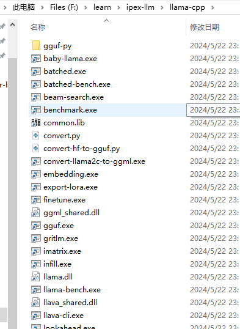
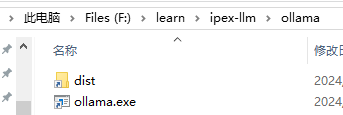

# 使用ipex-llm基于Ollama推理LLM 
> github地址: [ipex-llm](https://github.com/intel-analytics/ipex-llm)

> document： [ipex-llm](https://ipex-llm.readthedocs.io/en/latest/doc/LLM/Overview/install_gpu.html#windows)

**注意升级显卡驱动**

## 1. 创建conda环境，并安装ipex-llm
```
conda create -p F:\learn\ipex-llm\env python=3.11
conda activate F:\learn\ipex-llm\env
```
## 2. 安装ipex-llm for llama.cpp
```
pip install --pre --upgrade ipex-llm[cpp]
```
**Note: 配置conda镜像与pip镜像需要单独配置**

配置pip镜像：

> 1.临时换源：
> 
> 清华源
> 
> pip install xxxx -i https://pypi.tuna.tsinghua.edu.cn/simple
> 
> 阿里源
> 
> pip install xxxx -i https://mirrors.aliyun.com/pypi/simple/
> 
> 腾讯源
> 
> pip install xxxx -i http://mirrors.cloud.tencent.com/pypi/simple
> 
> 豆瓣源
> pip install xxxx -i http://pypi.douban.com/simple/
> 
> 将xxxx换成需要安装的包的名字
> 
> 2.永久换源：
> 
> 清华源
> 
> pip config set global.index-url https://pypi.tuna.tsinghua.edu.cn/simple
> 
> 阿里源
> 
> pip config set global.index-url https://mirrors.aliyun.com/pypi/simple/
> 
> 腾讯源
> 
> pip config set global.index-url http://mirrors.cloud.tencent.com/pypi/simple
> 
> 豆瓣源
> 
> pip config set global.index-url http://pypi.douban.com/simple/
> 
> 3.换回默认源
> 
> pip config unset global.index-url
## 3. Setup for running llama.cpp
``` bash
mkdir llama-cpp
cd llama-cpp
init-llama-cpp.bat
```

``` javascript
var a = []
function add(x) {
    return a.push(x)
}
```



## 4. Initialize Ollama
set up ollama link:
```
mkdir ollama
cd ollama
init-ollama.bat
```


send env variable of conda
```
set OLLAMA_NUM_GPU=999
set no_proxy=localhost,127.0.0.1
set ZES_ENABLE_SYSMAN=1
set SYCL_CACHE_PERSISTENT=1
```
run ollma service

如果之前已经安装了ollma, 此时就存在两个ollama, 能跑在GPU的ollama 在当前环境里面: `F:\learn\ipex-llm\env\Lib\site-packages\bigdl\cpp\libs`

在使用`ollma run` command 的时候默认是用的现有的,如果要跑这个版本需要将现有的ollama service 停掉, 然后执行;
```
cd F:\learn\ipex-llm\env\Lib\site-packages\bigdl\cpp\libs
.\ollama.exe serve
```
then start new conda ps command line, enter the env, run:

```
cd F:\learn\ipex-llm\env\Lib\site-packages\bigdl\cpp\libs
.\ollama.exe run qwen:14b-chat-v1.5-q4_K_M
```
**他们的模型是共用的**

